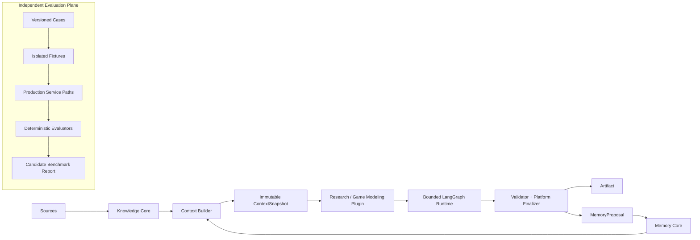

# Evidence-Grounded Personal Knowledge Agent Workspace

**证据约束的本地优先个人知识 Agent 工作台** —— 一个把已审核知识、项目记忆、受控上下文与可追溯 Agent 产物连接起来的本地优先工作空间。它不是把任意文档直接塞进提示词的普通 RAG：每次运行都绑定明确的 Knowledge scope、不可变 `ContextSnapshot`、领域插件 pin、工具审计、引用校验与人工治理边界。



## Why this project

An answer is not enough for long-running research or modeling work. The system needs to answer four questions together:

- Which reviewed evidence was allowed to influence this task?
- Which project facts and decisions were in scope?
- Which domain workflow and tool permissions produced the result?
- Which output or proposed memory update may a human accept, reject, or audit later?

The workspace keeps these responsibilities separate. Knowledge is reviewed evidence; Memory is project state; a `ContextSnapshot` is the governed, reproducible runtime input; an AgentRun produces traceable outputs rather than silently mutating trusted records.

## Core capabilities

- Evidence-grounded Knowledge Core with reviewed sources, documents, chunks, claims, evidence, and collection scope.
- Project-oriented Memory Core for projects, tasks, decisions, artifacts, knowledge scopes, plugin enablement, and reviewable memory proposals.
- Immutable, budgeted `ContextSnapshot` construction with provenance and scope filtering.
- Bounded, checkpointed LangGraph execution with auditable tool calls, cancellation/recovery semantics, validation, and finalization.
- Two first-party domain plugins: Research and deterministic Game Modeling.
- React Project Workspace projections for projects, tasks, context, runs, artifacts, and proposal review.
- Offline, local-first Phase 6 evaluation and demo evidence pack that exercise production service paths through isolated fixtures.

## Architecture

The product path is deliberately one-way at its trust boundaries:

1. Knowledge Core stores reviewed evidence and Memory Core stores project state.
2. Context Builder reads both under a task/project scope and persists a canonical `ContextSnapshot` only after the payload is normalized.
3. Agent Runtime resolves a static plugin pin, invokes its bounded LangGraph workflow, and records trace and tool-call facts.
4. The validator and Platform Finalizer decide whether an output may become an Artifact and whether a MemoryProposal may be created.
5. A proposal still requires the repository's review/commit governance; the Agent does not directly promote unreviewed facts or project state.

The detailed, current architecture is in [docs/architecture/01_PROJECT_SPEC.md](docs/architecture/01_PROJECT_SPEC.md). Historical pre-platform material is kept in [docs/legacy](docs/legacy/).

## Knowledge and Memory Governance

**Knowledge Core** is the evidence layer: sources, documents, chunks, entities, relations, claims, and evidence are not interchangeable with generated prose. Candidate knowledge follows review before it becomes usable formal knowledge.

**Memory Core** is the project layer: projects, workspace tasks, decisions, artifacts, scopes, enabled plugins, and `MemoryProposal` records have explicit lifecycle state and revisions. An Agent can propose a change; it cannot bypass review to make trusted project state.

SQLite is the operational fact store. Qdrant, Neo4j, and Obsidian-compatible projections remain supporting retrieval/projection components rather than alternate business truth.

## ContextSnapshot

`ContextSnapshot` is the contract between governed data and an AgentRun. It contains the selected task, project memory, allowed knowledge bundles, evidence provenance, constraints, tool context, selection trace, and token-budget diagnostics. It is canonicalized and hashable, so a later run, artifact projection, or evaluator can identify the exact input contract it used.

No-scope requests fail closed: no knowledge bundle and no business output are created merely to make a response look complete.

## Agent Runtime

The runtime dispatches a persisted AgentRun through a finite LangGraph workflow selected by its immutable plugin pin. Checkpoints support recovery from interruption; queue retries do not intentionally replay already completed business transitions. Tool calls are recorded with permissions, inputs, result summaries, and idempotency keys.

The Platform Finalizer owns writes for Agent outputs, Artifacts, and optional MemoryProposals. Plugins describe a governed finalization command but receive no direct persistence handle.

## Domain Plugins

### Research

The Research plugin exposes a foundation workflow and a research workflow. The research path requires a configured live LLM in normal product operation and validates evidence citations before finalization. Invalid citations can receive one bounded repair attempt; unresolved violations end in review rather than creating an Artifact or MemoryProposal.

### Game Modeling

The Game Modeling plugin is a first-party deterministic workflow over scoped Formula and Patch knowledge. It performs pure calculations, emits evidence-linked output, and fails closed when the requested patch version does not match the governed input. It owns neither a separate database nor a separate runtime.

## Human-in-the-loop

- Knowledge candidates require review before becoming trusted facts.
- Memory changes are represented as proposals with review/commit status.
- Artifact and run projections preserve AgentRun and ContextSnapshot provenance.
- Domain plugins are statically registered and project-enabled; they do not dynamically install code or gain arbitrary storage access.

## Evaluation

Phase 6 is an **independent Evaluation Plane**, not a product runtime or new fact source. Each case builds a fresh temporary SQLite database, checkpoint path, vault path, and fixture root; it blocks network sockets and drives existing Context Builder, Runtime, validator, finalizer, plugin registry, and Workspace services.

The current public result is a **deterministic evaluation candidate**. No human-approved baseline exists, so no regression comparison is available:

| Candidate experiment | Result | Isolation | Scope |
| --- | --- | --- | --- |
| `phase6-20260807T101302Z-7b90a436e6` | 13 passed, 0 failed, 0 error, 0 skipped | 4/4 attestations true | Full contract suite |
| `phase6-20260807T101505Z-534b3819bd` | 3 passed, 0 failed, 0 error, 0 skipped | passed | Reproducible demo subset |

Manifest SHA-256: `5c1a4878d037c7df0187b8f50daf2a8b96e6fcadc5f3834a307ee0061f1705c2`.

Evaluation fixtures use schema v15 only. The real operational SQLite baseline remains schema v14 and is not opened by the evaluation. `v0009` was not executed. There is no human-approved Phase 6 baseline; do not describe these results as baseline comparison or model-quality evidence.

Run the full offline suite:

```bash
./.venv/bin/python -m app.benchmarking \
  --manifest benchmarks/phase6/cases/v1/manifest.json \
  --output data/reports/phase6
```

See [docs/demo/BENCHMARK_SUMMARY.md](docs/demo/BENCHMARK_SUMMARY.md) for exact scope and [benchmarks/phase6/README.md](benchmarks/phase6/README.md) for runner details.

## Project Workspace

The React Workspace is a client over existing projections, not another fact store. Its routes cover the dashboard, project sections, task detail, AgentRun trace, artifact content, and proposal review. It does not expose checkpoint internals or arbitrary raw context payloads.

The repository also retains a Streamlit service in `docker-compose.yml` for compatibility with the earlier knowledge workflow. It is not the React Workspace. Public deployment documentation must select and verify the desired UI entry point rather than treating them as interchangeable.

## Demo

The deterministic demo is local and offline. It runs three curated service-path scenarios:

1. cited Research finalization;
2. deterministic Game Modeling calculation;
3. Workspace Artifact provenance projection.

```bash
./.venv/bin/python scripts/run_phase6_demo.py --output data/reports/phase6
```

The resulting immutable directory contains `run.json`, `report.md`, and `demo-summary.md`. It does not claim real-provider quality, production database validation, browser validation, or an accepted benchmark baseline. Use [docs/demo/DEMO_GUIDE.md](docs/demo/DEMO_GUIDE.md) to present it safely.

## Quick Start

### Backend and offline verification

Requirements: Python 3.11+, Docker Compose for the compatibility stack. Keep the default mock configuration for local tests; never copy a real provider key into source code or frontend build variables.

```bash
python -m venv .venv
source .venv/bin/activate
python -m pip install -r requirements.txt
cp .env.example .env

./.venv/bin/python -m pytest -p no:cacheprovider
./.venv/bin/python -m ruff check --no-cache .
./.venv/bin/python -m pip check
git diff --check
docker compose config --quiet
```

`docker compose up --build` starts the legacy-compatible API, worker, Qdrant, Neo4j, and Streamlit services. Treat it as a local development stack: set a non-default Neo4j password, review mounted data paths, and do not point it at an operational database without a backup and an explicit migration review.

### React Workspace

The React application lives in `frontend/` and is run separately from the Compose Streamlit service:

```bash
cd frontend
pnpm install --frozen-lockfile
pnpm dev
```

Validate it in a declared Node/pnpm environment with `pnpm test` and `pnpm build`. Node/npm were unavailable during the latest release audit, so that audit did not rerun these commands.

## Tech Stack

| Area | Implementation |
| --- | --- |
| Backend | Python, FastAPI, Pydantic, SQLite |
| Agent runtime | LangGraph, SQLite checkpointing, bounded workflows |
| Knowledge and projections | SQLite fact store, Qdrant, Neo4j, Obsidian-compatible projections |
| Frontend | React 19, TypeScript, Vite, Vitest, TanStack Query, Radix UI |
| Quality | Pytest, Ruff, deterministic Phase 6 evaluation, Docker Compose validation |

The repository package name remains `research-knowledge-core` for compatibility. The public product title is the title of this README.

## Safety Model

- Local-first operational data is kept outside the evaluation fixtures.
- `.env`, operational SQLite, checkpoints, raw papers, frontend dependency directories, and frontend build output are ignored by Git. Ignored does not make a file safe to upload: inspect archives and generated assets before sharing them.
- API keys belong only in local environment configuration. Do not compile them into browser assets; rotate any credential suspected to have entered a build artifact.
- Phase 6 blocks network access, uses scripted fixtures, and verifies that its temporary sandbox is removed.
- Production migrations, including `v0009`, are outside the evaluation and demo commands.

## Verified Engineering Status

Latest release audit verification:

- Backend pytest: **112 passed, 3 skipped**.
- Ruff: **passed**.
- `pip check`: **passed**.
- `git diff --check`: **passed**.
- `docker compose config --quiet`: **passed**.
- Phase 6 full candidate: **13 passed, 0 failed, 0 error, 0 skipped; 4/4 isolation attestations true**.
- Phase 6 demo candidate: **3 passed, 0 failed; isolation passed**.

These facts establish deterministic local contract coverage. They do not replace a human-approved benchmark baseline, browser build verification, a real-provider evaluation, or public-release security review.

## Limitations

- The curated Phase 6 suite measures governance and deterministic service-path contracts, not open-domain retrieval quality or real-LLM quality.
- No Phase 6 baseline has been accepted by a human reviewer.
- Frontend test/build was not rerun in the release-audit environment because Node/npm was unavailable.
- The Compose Streamlit compatibility UI and React Workspace require a deliberate deployment decision.
- This repository is local-first and does not claim multi-agent, MCP, web-search, temporal-memory, or production-monitoring capabilities.

## Roadmap

Release packaging work is intentionally separate from product capability work. Before a public release:

1. review and commit the current worktree as a coherent release candidate;
2. run React tests and production build in a declared Node environment;
3. verify no local secrets or generated assets are included in the published archive;
4. obtain explicit human approval before creating any Phase 6 baseline;
5. retain offline demo evidence alongside the release notes.

## Documentation

- [Current architecture](docs/architecture/01_PROJECT_SPEC.md)
- [Data and governance model](docs/architecture/03_DATA_MODEL_SPEC.md)
- [ContextSnapshot contract](docs/architecture/04_CONTEXT_ENGINEERING_SPEC.md)
- [Agent Runtime](docs/architecture/05_AGENT_RUNTIME_SPEC.md)
- [Domain Plugins](docs/architecture/06_DOMAIN_PLUGIN_SPEC.md)
- [Project Workspace](docs/architecture/07_UI_PRODUCT_SPEC.md)
- [Benchmark summary](docs/demo/BENCHMARK_SUMMARY.md)
- [Demo guide](docs/demo/DEMO_GUIDE.md)
- [Resume project brief](docs/demo/RESUME_PROJECT_BRIEF.md)
- [Historical material](docs/legacy/)
