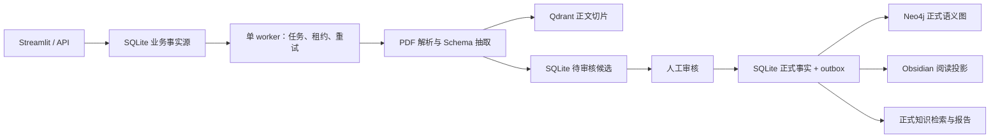

# Research Knowledge Core

Research Knowledge Core 是一个面向本地单用户的科研知识系统：将 PDF 解析为带页码证据的候选知识，经人工审核后保存为正式事实，并基于这些已审核知识生成可追溯的 Markdown 报告。

当前主线不兼容旧 API、CLI、配置或数据格式。历史版本已冻结在 [`archive/v1`](archive/v1/README.md)，不参与主项目导入、测试、Docker 构建和发布。

## 核心能力

- 本地路径或 URL 的 PDF 入库；不使用在线搜索或演示数据兜底。
- Pydantic Schema 约束的实体、关系、阅读卡和页码证据抽取。
- SQLite 持久化任务队列、审核事件、正式事实、投影 outbox 和报告。
- 候选只能从 `draft` 进入一次终态；相同决定幂等，不同决定返回 `409`。
- Qdrant 保存 PDF 正文切片，Neo4j 保存正式语义图，Obsidian 保存可再生阅读投影。
- 报告只消费已发布论文允许范围内的切片和正式图谱；最多修订一次。
- 报告持久化正文、证据包、证据落地率、引用覆盖率、引用忠实度和结构评分。

## 数据流



SQLite 是业务事实源。Neo4j、Qdrant 和 Obsidian 都是可恢复下游；下游暂时不可用不会撤销已经提交的审核事实。

## 快速开始

要求 Python 3.11+、Docker 和 Docker Compose。

```bash
python -m venv .venv
source .venv/bin/activate
pip install -r requirements.txt
cp .env.example .env
```

在 `.env` 中配置真实 LLM provider 和 API Key。正式入库和报告明确拒绝 `mock`。

一键启动：

```bash
docker compose up --build
```

- Streamlit：<http://localhost:8501>
- FastAPI：<http://localhost:8000/docs>
- Qdrant：<http://localhost:6333/dashboard>
- Neo4j：<http://localhost:7474>

也可以分别启动：

```bash
.venv/bin/uvicorn app.api.main:app --reload
.venv/bin/python -m app.worker
.venv/bin/streamlit run app/ui/streamlit_app.py
```

CLI 只保留 PDF 解析和 worker：

```bash
.venv/bin/python main.py parse-pdf data/raw_papers/example.pdf --max-pages 10
.venv/bin/python main.py worker
```

## 使用流程

1. 在“知识入库”提交主题和 PDF 来源；API 返回 `202`，worker 异步领取任务。
2. worker 先完成所有 PDF 解析和 Qdrant 索引，再创建可审核候选。Qdrant 失败不会留下候选半成品。
3. 在“审核队列”编辑、批准、驳回或合并候选。
4. SQLite 在同一事务中写入正式事实、唯一审核事件和 projection outbox。
5. worker 幂等投影到 Neo4j 和 Obsidian；全部成功后入库状态变为 `completed`。
6. 在“研究报告”提交研究问题。报告只检索已发布论文的切片，并保存引用证据和质量评估。

入库状态：

```text
queued -> running -> needs_review -> publishing -> completed
                    |                 |
                    +-> failed <------+-> retry
running -> interrupted -> retry
```

## API

知识接口：

- `POST /api/knowledge/ingestions`
- `GET /api/knowledge/ingestions`
- `GET /api/knowledge/ingestions/{id}`
- `POST /api/knowledge/ingestions/{id}/retry`
- `GET /api/knowledge/ingestions/{id}/candidates`
- `PATCH /api/knowledge/candidates/{id}`
- `POST /api/knowledge/candidates/{id}/decision`
- `POST /api/knowledge/ingestions/{id}/approve-ready`
- `GET /api/knowledge/topics`
- `GET /api/knowledge/topics/{slug}`
- `GET /api/knowledge/graph`
- `GET /api/knowledge/search`

报告接口：

- `POST /api/reports`
- `GET /api/reports`
- `GET /api/reports/{id}`
- `GET /api/reports/{id}/evidence`
- `GET /api/reports/{id}/download`

健康检查 `GET /health` 返回 Schema 版本、真实 LLM 状态、任务队列、待投影/失败投影，以及 Qdrant 和 Neo4j 可用性。

## 存储与兼容边界

为保留已有 Knowledge Base 数据，当前物理名称暂不迁移：

- SQLite：`data/knowledge/knowledge.db`
- Qdrant collection：`knowledge_chunks_v2`
- Neo4j labels：`KnowledgeEntityV2`、`KnowledgeTopicV2`、`KG_RELATION_V2`
- Obsidian：`data/obsidian_vault_v2`

这些只是稳定的内部存储名，对外产品统一称为 Research Knowledge Core。系统不会删除或读写历史 `data/obsidian_vault`、memory 等用户数据。

## 测试与质量评测

```bash
.venv/bin/pytest -q
.venv/bin/ruff check .
git diff --check
```

30 问题、10 PDF 的版本化检索集位于 [`benchmarks/knowledge_core_questions.json`](benchmarks/knowledge_core_questions.json)：

```bash
.venv/bin/python -m app.knowledge.benchmark --top-k 5 \
  --output data/reports/knowledge_core_benchmark.json
```

目标门槛为 Recall@5 ≥ 0.80、正式证据落地率 100%、报告引用覆盖率 ≥ 0.90。每次正式评测都应固定模型、Prompt、数据和配置版本。

已保存的固定检索基准、隔离浏览器 E2E、真实 LLM 合成证据 smoke 和 Docker 构建验收结果位于 [`benchmarks/results`](benchmarks/results)。

## v1 冻结归档

归档基线为提交 `1fb7dc6`，Git tag 为 `v1-archive-1fb7dc6`。归档拥有独立依赖、锁文件、运行说明和 38 项原测试：

```bash
cd archive/v1
python -m venv .venv
source .venv/bin/activate
pip install -r requirements.lock
pytest -q
```

归档只用于历史复现、简历取材和项目复盘，不接受主线模块依赖或功能修复。

## 文档

- [当前与目标架构](docs/architecture.md)
- [三个迭代路线与验收](docs/development_roadmap.md)
- [完整开发复盘与简历素材](docs/project_development_review.md)
- [开发日志](docs/development_journal.md)
- [人工验收流程与 API 脚本](docs/manual_testing_guide.md)
- [v1 归档清单](archive/v1/ARCHIVE_MANIFEST.md)
