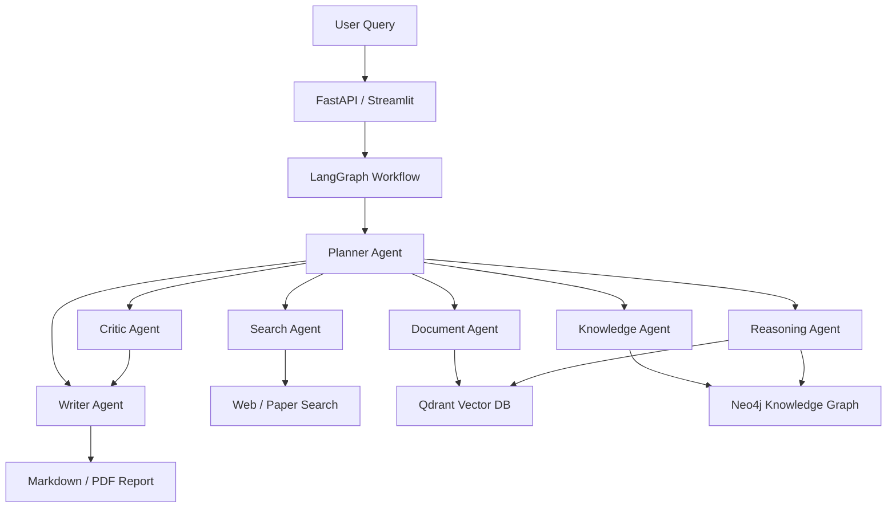

# AI-Research-Agent

AI Research Agent with GraphRAG is a multi-agent research analysis system. It is designed to take a research topic, plan the work, call tools, analyze documents, build a knowledge graph, run GraphRAG reasoning, and generate a structured research report.

This repository is being built phase by phase. The current implementation is **Phase 4: Agentic GraphRAG**.

默认交互和报告输出优先面向中文用户；工具名和模块名保留英文，方便工程调试和 GitHub 展示。

## Core Features

- LangGraph-based agent workflow
- Planner Agent for task decomposition
- Basic tool calling with a tool registry
- LLM provider abstraction for OpenAI, Qwen, DeepSeek, and local mock mode
- Typed research state and structured plan schema
- arXiv-compatible paper search with offline fallback
- PDF parsing utility
- Document chunking
- Hash embeddings for local demos
- In-memory vector retrieval and Qdrant integration
- Entity and relation extraction
- In-memory knowledge graph and Neo4j integration
- Graph path retrieval and GraphRAG reasoning
- Long-term JSON memory
- Critic Agent feedback
- Reflection-based report revision
- Evaluation metrics for retrieval, graph quality, structure, and grounding
- CLI demo for running the research pipeline

## Target Architecture



## Installation

```bash
python3.11 -m venv .venv
source .venv/bin/activate
pip install -r requirements.txt
cp .env.example .env
```

By default, `.env.example` uses `LLM_PROVIDER=mock`, so the Phase 4 workflow can run without an API key.

To use OpenAI:

```env
LLM_PROVIDER=openai
OPENAI_API_KEY=your_api_key
LLM_MODEL=gpt-4o-mini
```

To use Qwen:

```env
LLM_PROVIDER=qwen
QWEN_API_KEY=your_api_key
QWEN_MODEL=qwen-plus
```

To use DeepSeek:

```env
LLM_PROVIDER=deepseek
DEEPSEEK_API_KEY=your_api_key
DEEPSEEK_MODEL=deepseek-v4-flash
```

DeepSeek 推荐模型：

```env
# 更快、更适合日常开发验证
DEEPSEEK_MODEL=deepseek-v4-flash

# 更强、更适合高质量报告生成
DEEPSEEK_MODEL=deepseek-v4-pro
```

项目配置层会校验 DeepSeek 模型名，目前仅允许 `deepseek-v4-flash` 和 `deepseek-v4-pro`，避免误用旧模型名。

## Run Phase 4 Demo

```bash
python main.py run "GraphRAG 在科研文献综述中的应用"
```

Expected output:

- 中文结构化研究计划
- 工具调用结果
- 候选论文集合
- 文档切片统计
- 向量检索证据
- 实体和关系抽取结果
- 图谱路径
- GraphRAG 推理总结
- Evaluation 评估指标
- Critic Review 审查意见
- 长期记忆写入
- Phase 4 Markdown 研究报告

Offline mode is the default so the project can run without network access:

```bash
python main.py run "AI Agent 在科学发现中的应用" --offline
```

Disable memory for a stateless run:

```bash
python main.py run "AI Agent 在科学发现中的应用" --offline --no-memory
```

Enable live arXiv search:

```bash
python main.py run "GraphRAG for scientific literature review" --live-search --paper-limit 5
```

Use Qdrant after starting a local Qdrant service:

```bash
python main.py run "GraphRAG for scientific literature review" --vector-store qdrant
```

Use Neo4j after starting a local Neo4j service:

```bash
python main.py run "GraphRAG for scientific literature review" --graph-store neo4j
```

Long-term memory is stored locally at `data/memory/research_memory.json`. The JSON memory file is ignored by Git.

Parse a local or remote PDF:

```bash
python main.py parse-pdf data/raw_papers/example.pdf --max-pages 5
```

## Development Roadmap

- Phase 1: Basic Agent Framework
- Phase 2: Research Pipeline with search, PDF parsing, chunking, and vector RAG
- Phase 3: GraphRAG with entity extraction, relation extraction, Neo4j storage, and graph reasoning
- Phase 4: Memory, reflection, critic loop, and evaluation
- Phase 5: FastAPI backend, Streamlit UI, Docker deployment, README, and demo assets

## Suggested Git Commit Plan

```text
init project structure
add llm provider abstraction
add langgraph workflow state
implement planner agent
add basic tool calling
implement search and document pipeline
add vector retrieval with qdrant
integrate neo4j knowledge graph
implement graphrag reasoning
add memory and reflection loop
add evaluation module
add fastapi backend
add streamlit demo ui
add docker deployment
complete docs and readme
release v1.0
```
