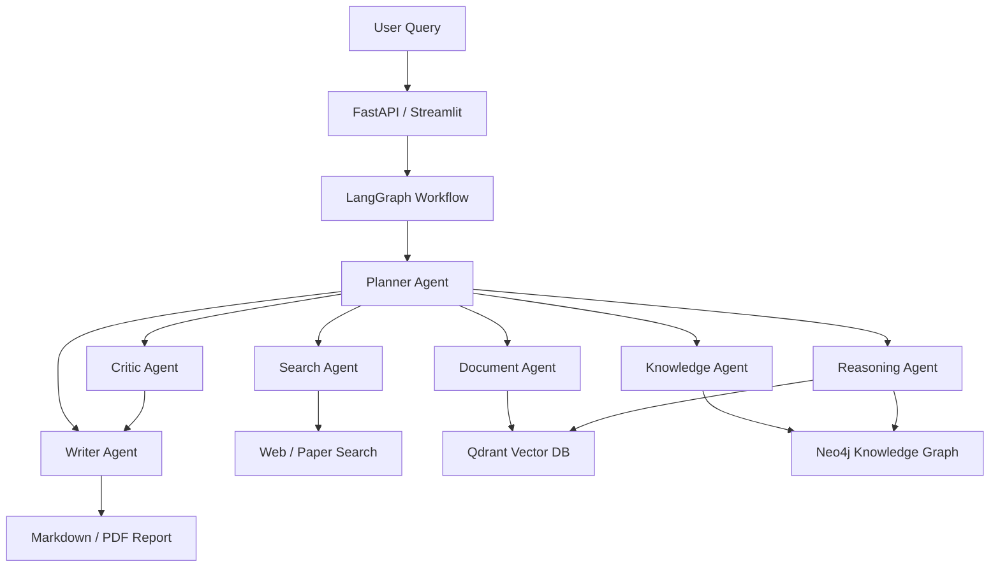

# AI-Research-Agent

AI Research Agent with GraphRAG is a multi-agent research analysis system. It is designed to take a research topic, plan the work, call tools, analyze documents, build a knowledge graph, run GraphRAG reasoning, and generate a structured research report.

This repository is being built phase by phase. The current implementation is **Phase 5: Evidence-Governed Agentic GraphRAG**.

默认交互和报告输出优先面向中文用户；工具名和模块名保留英文，方便工程调试和 GitHub 展示。

## Core Features

- LangGraph-based agent workflow
- Planner Agent for task decomposition
- Basic tool calling with a tool registry
- LLM provider abstraction for OpenAI, Qwen, DeepSeek, and local mock mode
- Typed research state and structured plan schema
- arXiv-compatible paper search with offline fallback
- Multi-query arXiv retrieval with topic-aware reranking
- Explicit PDF ingestion into the GraphRAG workflow
- Document chunking
- Chinese-aware lightweight hash embeddings for local demos
- In-memory vector retrieval and Qdrant integration
- Entity and relation extraction
- In-memory knowledge graph and Neo4j integration
- Graph path retrieval and GraphRAG reasoning
- Long-term JSON memory
- LLM-backed Writer Agent with evidence-constrained Chinese report drafting
- Critic Agent feedback with a bounded Writer revision loop
- Post-reflection quality reevaluation
- Quality-aware evaluation for retrieval coverage, relevance, graph paths, report structure, and citation fidelity
- Critical quality gates that prevent high structural scores from masking low relevance
- Source provenance tiers for primary full text, online metadata, and offline demos
- Obsidian-compatible Markdown Vault export with GraphML and JSON graph artifacts
- FastAPI task API, Streamlit research workspace, and Docker Compose deployment
- CLI demo for running the research pipeline

## Target Architecture



## Installation

```bash
python3.11 -m venv .venv
source .venv/bin/activate
pip install -r requirements.txt
cp .env.example .env
```

By default, `.env.example` uses `LLM_PROVIDER=mock`, so the Phase 4 workflow can run without an API key.

To use OpenAI:

```env
LLM_PROVIDER=openai
OPENAI_API_KEY=your_api_key
LLM_MODEL=gpt-4o-mini
```

To use Qwen:

```env
LLM_PROVIDER=qwen
QWEN_API_KEY=your_api_key
QWEN_MODEL=qwen-plus
```

To use DeepSeek:

```env
LLM_PROVIDER=deepseek
DEEPSEEK_API_KEY=your_api_key
DEEPSEEK_MODEL=deepseek-v4-flash
```

DeepSeek 推荐模型：

```env
# 更快、更适合日常开发验证
DEEPSEEK_MODEL=deepseek-v4-flash

# 更强、更适合高质量报告生成
DEEPSEEK_MODEL=deepseek-v4-pro
```

项目配置层会校验 DeepSeek 模型名，目前仅允许 `deepseek-v4-flash` 和 `deepseek-v4-pro`，避免误用旧模型名。

## Run Evidence-Governed Demo

```bash
python main.py run "GraphRAG 在科研文献综述中的应用"
```

Expected output:

- 中文结构化研究计划
- 工具调用结果
- 候选论文集合
- 文档切片统计
- 向量检索证据
- 实体和关系抽取结果
- 图谱路径
- GraphRAG 推理总结
- Evaluation 评估指标
- Critic Review 审查意见
- 主题相关性与引用忠实度评估
- Writer Agent 研究结论与受控 Reflection 修订
- 长期记忆读写状态
- Phase 4.3 Markdown 研究报告与证据状态

Offline mode is the default so the project can run without network access:

```bash
python main.py run "AI Agent 在科学发现中的应用" --offline
```

离线模式只用于演示：报告会标记为 `simulation`，不会写入长期记忆或 Obsidian Vault。

Disable memory for a stateless run:

```bash
python main.py run "AI Agent 在科学发现中的应用" --offline --no-memory
```

Enable live arXiv search:

```bash
python main.py run "GraphRAG for scientific literature review" --live-search --paper-limit 5
```

Run GraphRAG against an external paper's full text. `--pdf` is explicit: the
workflow will not automatically download every paper returned by search.

```bash
python main.py run "GraphRAG 如何改进面向科研文献综述的查询聚焦摘要？" \
  --live-search \
  --paper-limit 5 \
  --top-k 5 \
  --pdf "https://arxiv.org/pdf/2404.16130" \
  --pdf-max-pages 10 \
  --no-memory
```

For multiple source papers, repeat `--pdf`:

```bash
python main.py run "比较多智能体协作、长期记忆与智能体评估方法" \
  --live-search \
  --pdf "https://arxiv.org/pdf/2308.08155" \
  --pdf "https://arxiv.org/pdf/2310.08560" \
  --pdf "https://arxiv.org/pdf/2308.03688" \
  --pdf-max-pages 10 \
  --no-memory
```

## Obsidian Knowledge Vault

仅当真实来源质量门槛通过时，系统才会将报告、论文、概念和关系写入 Obsidian Vault。原始 PDF 不会复制到 Vault；笔记保存本地路径、URL、DOI 和证据 ID。

```bash
python main.py run "GraphRAG 如何支持科研文献综述？" \
  --live-search \
  --pdf "data/raw_papers/2404-16130.pdf" \
  --export-obsidian \
  --obsidian-vault data/obsidian_vault
```

打开 `data/obsidian_vault` 作为 Obsidian Vault 后，可使用原生 Graph View 浏览 Wiki Links。`Exports/<run-id>/graph.json` 与 `graph.graphml` 可供 Streamlit、Gephi 或其他图工具使用。

## API, UI, and Docker

启动 API：

```bash
uvicorn app.api.main:app --reload --port 8000
```

启动 Streamlit：

```bash
streamlit run app/ui/streamlit_app.py
```

启动完整持久化环境：

```bash
docker compose up --build
```

If the default host ports are already in use, set `API_PORT` and
`STREAMLIT_PORT` in `.env` before starting Compose (for example, `8003` and
`8503`). Qdrant and Neo4j ports can be overridden with `QDRANT_PORT`,
`NEO4J_HTTP_PORT`, and `NEO4J_BOLT_PORT` as well.

The Compose stack uses Qdrant 1.18 and a `qdrant_data_v118` volume. This keeps
an older 1.10 development volume intact; re-ingest source PDFs when migrating
from that earlier local format.

- API 文档：`http://localhost:8000/docs`
- Streamlit：`http://localhost:8501`
- Neo4j Browser：`http://localhost:7474`

`GET /health` 会显示 Qdrant 与 Neo4j 连通性；不可用时工作流会记录原因并降级到内存后端。

Use Qdrant after starting a local Qdrant service:

```bash
python main.py run "GraphRAG for scientific literature review" --vector-store qdrant
```

Use Neo4j after starting a local Neo4j service:

```bash
python main.py run "GraphRAG for scientific literature review" --graph-store neo4j
```

Long-term memory is stored locally at `data/memory/research_memory.json`. The JSON memory file is ignored by Git.

Parse a local or remote PDF:

```bash
python main.py parse-pdf data/raw_papers/example.pdf --max-pages 5
```

## Development Roadmap

- Phase 1: Basic Agent Framework
- Phase 2: Research Pipeline with search, PDF parsing, chunking, and vector RAG
- Phase 3: GraphRAG with entity extraction, relation extraction, Neo4j storage, and graph reasoning
- Phase 4: Memory, reflection, critic loop, and evaluation
- Phase 4.1: Full-text PDF ingestion, query-aware retrieval, graph hygiene, and quality-aware evaluation
- Phase 4.2: LLM Writer, bounded Critic-Reflection revision, critical quality gates, and bilingual retrieval expansion
- Phase 4.3: source governance, Obsidian Vault export, graph artifacts, and metadata enrichment
- Phase 4.4: memory-store abstraction, local/global/hybrid GraphRAG, and query-personalized graph reranking
- Phase 5: FastAPI backend, Streamlit UI, Docker Compose, health checks, and deployment documentation

## Suggested Git Commit Plan

```text
init project structure
add llm provider abstraction
add langgraph workflow state
implement planner agent
add basic tool calling
implement search and document pipeline
add vector retrieval with qdrant
integrate neo4j knowledge graph
implement graphrag reasoning
add memory and reflection loop
add evaluation module
add fastapi backend
add streamlit demo ui
add docker deployment
complete docs and readme
release v1.0
```
