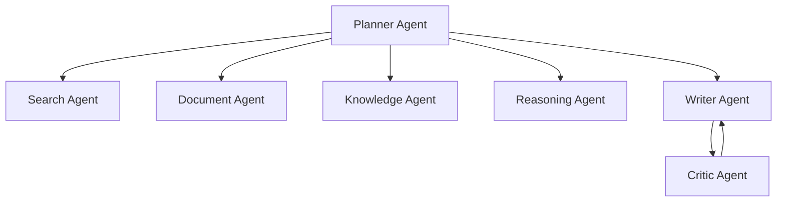

# Architecture

## Goal

AI-Research-Agent is designed as an autonomous research analysis system rather than a simple chatbot. The system separates planning, retrieval, knowledge extraction, reasoning, writing, reflection, memory, and evaluation into explicit components.

The default user-facing report language is Chinese, while code modules and tool identifiers remain English for engineering clarity.

## Phase 5 Scope

Phase 4 extends GraphRAG into a fuller agent system:

- typed workflow state
- LLM provider abstraction
- Planner Agent
- tool registry
- LangGraph workflow
- CLI demo
- Search Agent
- PDF parsing utility
- Document Agent
- chunking and embedding
- in-memory vector store and Qdrant adapter
- RAG retrieval node
- Knowledge Agent
- entity extraction
- relation extraction
- in-memory graph store and Neo4j adapter
- graph path retrieval
- GraphRAG reasoning node
- memory context retrieval
- Critic Agent
- Reflection Agent
- Evaluation module
- long-term memory writeback
- evidence provenance and formal-knowledge admission gate
- Obsidian Vault exporter and graph artifacts
- FastAPI task API and Streamlit workspace

The workflow currently runs:

## Target Multi-Agent Workflow

## Storage Design

- Qdrant stores dense vector embeddings for document chunks.
- Neo4j stores entities, claims, papers, methods, datasets, and relationships.
- The memory module stores previous topics, user preferences, and reusable research context.
- Obsidian Vault stores a one-way, human-reviewable Markdown projection of formal research knowledge.

Phase 4 defaults to in-memory vector and graph stores so the demo runs without Docker. Set
`VECTOR_STORE_PROVIDER=qdrant` or pass `--vector-store qdrant` after starting Qdrant.
Set `GRAPH_STORE_PROVIDER=neo4j` or pass `--graph-store neo4j` after starting Neo4j.
Phase 4 stores long-term memories in `data/memory/research_memory.json`, which is ignored by Git.

## Evidence Governance

- `primary_fulltext`: user-selected local or remote PDFs, preferred during retrieval.
- `online_metadata`: traceable online paper metadata such as arXiv records.
- `offline_demo`: deterministic examples used only for demo execution.

The evaluator adds `source_quality` as a critical metric. Offline-only output is a simulation and cannot be written to long-term memory or Obsidian. When real sources are present, offline chunks are removed from the formal evidence set before report generation.

## Obsidian Projection

The exporter writes `00_Runs`, `10_Papers`, `20_Concepts`, `30_Claims`, and `40_Reports` as linked Markdown notes. `Exports/<run-id>` includes JSON and GraphML representations for tools that need labeled graph edges. Obsidian is a review surface; Neo4j and Qdrant remain machine retrieval backends.

## GraphRAG Design

The GraphRAG layer combines:

1. vector retrieval for semantically relevant chunks
2. entity linking from query to graph nodes
3. graph traversal for multi-hop context
4. LLM reasoning over combined vector and graph evidence
5. citation-aware report generation

Current GraphRAG reasoning uses deterministic local synthesis so it can run without API keys.
Current Phase 4 critic and evaluation use deterministic local scoring so tests remain stable.
LLM-powered critique can be added later behind the same Critic Agent interface.
