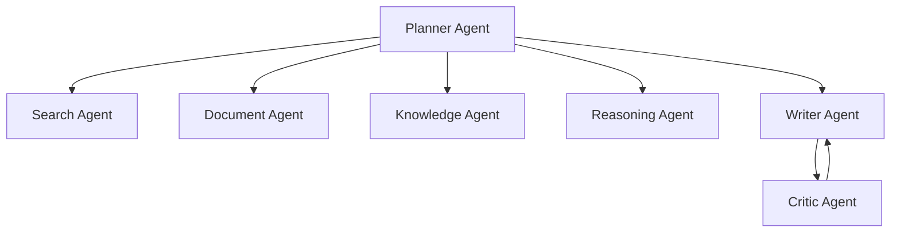

# Architecture

## Goal

AI-Research-Agent is designed as an autonomous research analysis system rather than a simple chatbot. The system separates planning, retrieval, knowledge extraction, reasoning, writing, reflection, memory, and evaluation into explicit components.

## Phase 3 Scope

Phase 3 extends the research pipeline into GraphRAG:

- typed workflow state
- LLM provider abstraction
- Planner Agent
- tool registry
- LangGraph workflow
- CLI demo
- Search Agent
- PDF parsing utility
- Document Agent
- chunking and embedding
- in-memory vector store and Qdrant adapter
- RAG retrieval node
- Knowledge Agent
- entity extraction
- relation extraction
- in-memory graph store and Neo4j adapter
- graph path retrieval
- GraphRAG reasoning node

The workflow currently runs:

```mermaid
flowchart LR
    Q["Research Topic"] --> P["Planner Node"]
    P --> T["Tool Executor Node"]
    T --> S["Search Node"]
    S --> D["Document Node"]
    D --> K["Knowledge Node"]
    K --> R["Retrieval Node"]
    R --> G["Graph Reasoning Node"]
    G --> W["Synthesis Node"]
    W --> END["Markdown Summary"]
```

## Target Multi-Agent Workflow

## Storage Design

- Qdrant stores dense vector embeddings for document chunks.
- Neo4j stores entities, claims, papers, methods, datasets, and relationships.
- The memory module stores previous topics, user preferences, and reusable research context.

Phase 3 defaults to in-memory vector and graph stores so the demo runs without Docker. Set
`VECTOR_STORE_PROVIDER=qdrant` or pass `--vector-store qdrant` after starting Qdrant.
Set `GRAPH_STORE_PROVIDER=neo4j` or pass `--graph-store neo4j` after starting Neo4j.

## GraphRAG Design

The GraphRAG layer combines:

1. vector retrieval for semantically relevant chunks
2. entity linking from query to graph nodes
3. graph traversal for multi-hop context
4. LLM reasoning over combined vector and graph evidence
5. citation-aware report generation

Current Phase 3 reasoning uses deterministic local synthesis so it can run without API keys.
Later phases will add LLM-powered extraction, reflection, and evaluation loops.
