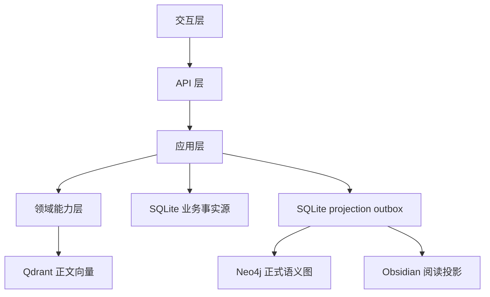
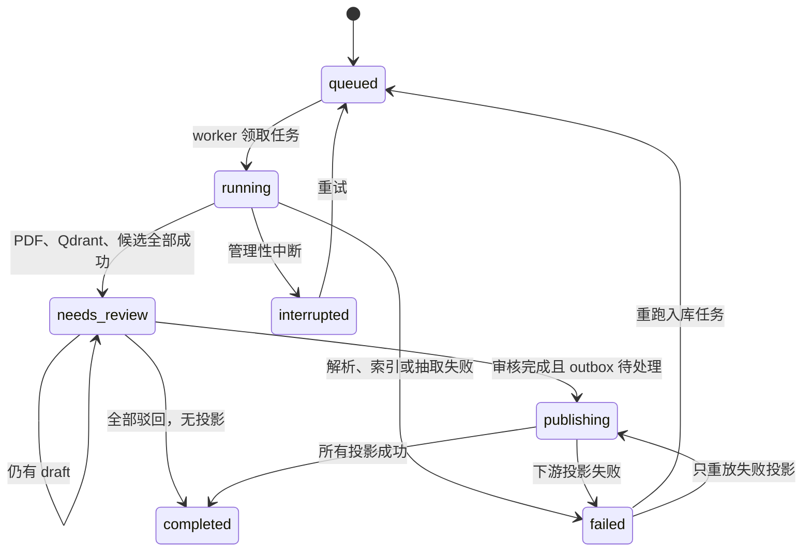
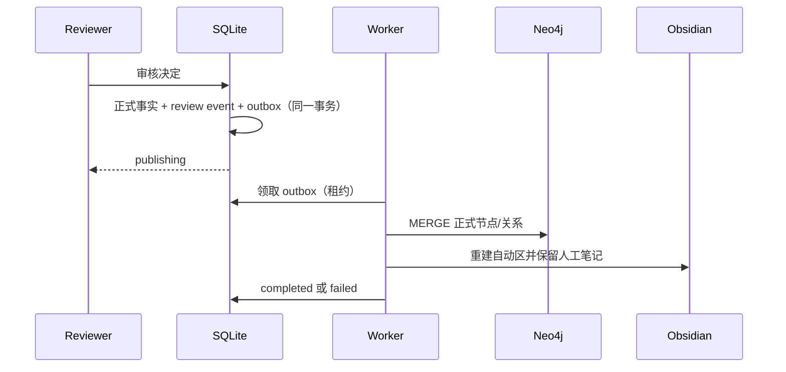
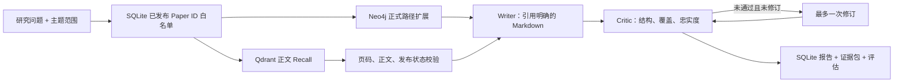

# Research Knowledge Core 架构

## 1. 架构目标

主项目只承担两件事：把 PDF 转换为可审核、可恢复的正式研究知识；只使用这些正式知识生成可追溯报告。知识集合是可选组织维度，留空进入“收件箱”。它不兼容归档版本的 Planner、Search Agent、ResearchState、启发式图谱、JSON Memory、Evaluation 或旧导出器。

本阶段面向本地单用户，不包含登录、租户隔离、Redis、Celery 或云端分布式部署。

## 2. 五层结构

| 层 | 当前模块 | 职责 |
|---|---|---|
| 交互层 | `app/ui/streamlit_app.py` | 入库、审核、探索、报告和任务历史 |
| API 层 | `app/api/main.py` | `/api/knowledge/*`、`/api/reports/*`、健康检查 |
| 应用层 | `app/knowledge/service.py`、`reports.py`、`app/worker.py` | 状态机、审核、查询、任务与投影调度 |
| 领域能力层 | `schemas.py`、`extractor.py`、`query.py`、`app/llms`、PDF/embedding | Schema、证据、抽取、正式检索和写作评估 |
| 基础设施层 | `repository.py`、`projector.py`、`obsidian.py` | SQLite、Qdrant、Neo4j、Obsidian |

## 3. 数据权威

| 数据 | 权威存储 | 恢复方式 |
|---|---|---|
| 入库状态、任务、租约、尝试次数、错误 | SQLite | worker 重新领取过期任务 |
| 候选、审核事件、规范实体、正式关系 | SQLite | 不从下游反向覆盖 |
| 投影意图和投影状态 | SQLite outbox | 幂等重放到下游 |
| PDF 正文切片和 embedding | Qdrant | 从源 PDF 重新入库 |
| 正式实体与关系路径 | Neo4j | 从 SQLite 正式事实重放 |
| 人类可读笔记、MOC、Canvas | Obsidian | 从 SQLite 重建，保留 `## 人工笔记` |
| 报告正文、证据包和评估 | SQLite | API 可重复读取和下载 |
| 论文内术语提及 | SQLite `source_mentions` | 可保留为待定，不进入跨论文图谱 |
| 跨论文概念词义 | SQLite `concept_senses` | 同名可有多个词义，显式链接才复用 |

物理存储名保留 `knowledge_chunks_v2`、`KnowledgeEntityV2` 和 `data/obsidian_vault_v2`，仅为兼容已有当前数据；这些名称不代表对外版本协议。

## 4. 入库与审核状态机

Qdrant 索引在候选创建前完成。索引失败可以留下可清理的文档元数据，但不会产生可审核候选，避免半成品进入审核队列。

### 审核一致性

每个候选的终态更新使用 `UPDATE ... WHERE status = 'draft'` 并检查受影响行数。批准或链接事务内同时写入：

1. 正式实体或关系；
2. 候选终态；
3. 唯一审核事件；
4. 对发布/合并决定创建 projection outbox。

“仅保留论文内提及”同样写入唯一审核事件和 `source_mentions`，但不创建正式实体、关系或 projection outbox。论文正文仍可作为报告证据，未解决的词义不会污染正式图谱。

相同决定再次提交返回幂等结果；不同终态重放返回 `409`。并发审核由 SQLite `BEGIN IMMEDIATE` 串行化，最终只产生一份正式事实、一条审核事件和一个 outbox 事件。

## 5. 可靠任务与投影

API 不执行长任务，只在 SQLite 创建 `knowledge_jobs`。单 worker 按顺序领取 ingestion/report job；每条任务记录状态、租约截止时间、尝试次数和最近错误。启动时和租约过期时，运行中任务可以重新排队。

审核事实提交后，worker 领取 `projection_outbox`：

Neo4j 使用稳定 ID 和 `MERGE`；Obsidian 自动区可重复生成，因此 outbox 重放不会产生重复正式知识。

## 6. 正式知识查询与报告

报告链路新建状态和服务，不导入任何归档实现：

查询先从 SQLite 计算已发布论文 ID 白名单，再过滤 Qdrant 结果。证据为空时明确失败；不回退到 mock、在线搜索、未审核候选或归档数据。

当前 Critic 记录：

- evidence grounding：每条证据有正式 paper ID、chunk ID、正文和有效页码；
- citation coverage：返回证据中被正文引用的比例；
- citation fidelity：报告引用 ID 属于证据包的比例；
- structure score：报告 Markdown 结构完整度；
- revision applied：是否使用过唯一一次修订机会。

## 7. Schema 迁移

`KnowledgeRepository` 启动时创建 `schema_migrations`，按整数版本顺序执行幂等 SQL。当前版本：

1. 入库、文档、候选、审核事件、正式实体/关系和主题映射；
2. 持久任务、projection outbox 和报告；
3. 每候选唯一审核事件与任务/投影租约索引；
4. 报告运行版本、模型、配置、调用次数、成本和时延元数据。
5. 知识集合、入库主集合和知识项来源集合归属；
6. 来源提及、概念词义和显式提及—词义链接，并移除“名称 + 类型”唯一约束。

生产数据迁移只允许追加新版本，不修改已记录的历史迁移。

## 8. 运行隔离

- 根 pytest 只发现 `tests/`；归档测试必须在 `archive/v1` 独立运行。
- Ruff 排除 `archive/`。
- `.dockerignore` 排除 `archive/`，根镜像不包含历史源码。
- 活动代码不从 `archive` 导入，归档也不得依赖主线模块。
- 历史用户数据不删除；主线只读写当前 Knowledge Core 配置的路径。
