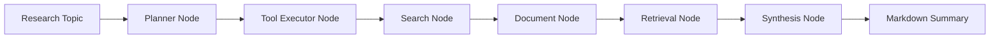
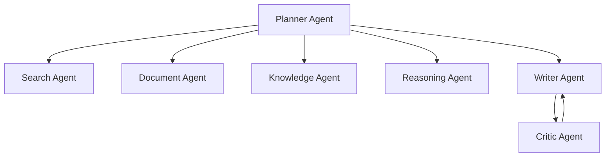

# Architecture

## Goal

AI-Research-Agent is designed as an autonomous research analysis system rather than a simple chatbot. The system separates planning, retrieval, knowledge extraction, reasoning, writing, reflection, memory, and evaluation into explicit components.

## Phase 2 Scope

Phase 2 extends the foundation into a research pipeline:

- typed workflow state
- LLM provider abstraction
- Planner Agent
- tool registry
- LangGraph workflow
- CLI demo
- Search Agent
- PDF parsing utility
- Document Agent
- chunking and embedding
- in-memory vector store and Qdrant adapter
- RAG retrieval node

The workflow currently runs:

## Target Multi-Agent Workflow

## Storage Design

- Qdrant stores dense vector embeddings for document chunks.
- Neo4j stores entities, claims, papers, methods, datasets, and relationships.
- The memory module stores previous topics, user preferences, and reusable research context.

Phase 2 defaults to an in-memory vector store so the demo runs without Docker. Set
`VECTOR_STORE_PROVIDER=qdrant` or pass `--vector-store qdrant` after starting Qdrant.

## GraphRAG Design

The final GraphRAG layer will combine:

1. vector retrieval for semantically relevant chunks
2. entity linking from query to graph nodes
3. graph traversal for multi-hop context
4. LLM reasoning over combined vector and graph evidence
5. citation-aware report generation
