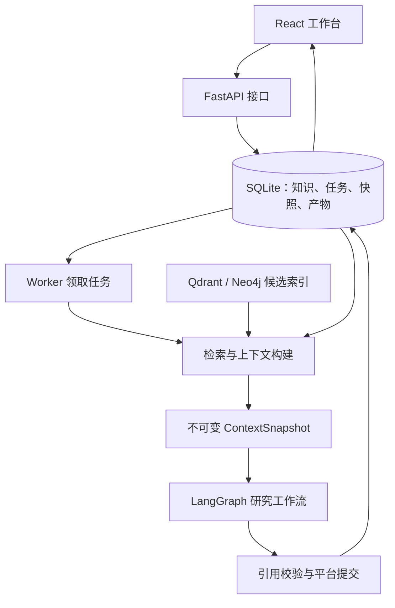

# 架构概览

证据驱动的智能研究工作台把资料审核、证据检索、研究报告和反馈修订串成一个流程。后端采用模块化单体：FastAPI 提供接口，独立 Worker 执行长任务，SQLite 保存正式业务数据。

## 一次研究怎样完成

用户先导入资料并审核知识，再为项目指定可用资料范围。任务执行前完成检索、来源复核和上下文冻结。工作流围绕这份固定证据生成报告，平台校验后保存产物。反馈修订创建新快照和新运行，旧报告仍可追溯。

快速报告 `quick_report` 使用来源与正文切片；项目研究 `project_run` 使用包含主张、证据及来源关系的 claim bundle。两条链路复用检索组件，但保留各自的完整度和范围校验。

## 代码导航

| 目录 | 职责 |
| --- | --- |
| [app/api](../../app/api/) | 路由、请求校验和服务装配 |
| [app/knowledge](../../app/knowledge/) | 导入、候选审核、正式知识、投影与快速报告 |
| [app/retrieval](../../app/retrieval/) | 检索策略、向量适配、候选排序和回读契约 |
| [app/context](../../app/context/) | 项目范围校验、证据选取、预算和快照冻结 |
| [app/agent](../../app/agent/) | 工作流、运行状态、工具记录、产物提交与反馈 |
| [app/memory](../../app/memory/) | 项目、任务、决策、产物与待审记忆建议 |
| [app/domain_plugins](../../app/domain_plugins/) | 静态领域注册和受限工作流接口 |
| [app/research_commands](../../app/research_commands/) | 统一研究入口和持久化命令编排 |
| [app/runtime](../../app/runtime/) | 持久任务队列、执行器心跳与运维状态 |
| [app/workspace](../../app/workspace/) | 工作台数据视图 |
| [app/persistence](../../app/persistence/)、[app/worker.py](../../app/worker.py) | SQLite、增量迁移、备份及队列执行 |
| [frontend/src](../../frontend/src/) | React 页面、API 客户端和交互组件 |
| [app/experiments](../../app/experiments/) | 实验归档的只读视图、语义观察和标注汇总 |
| [app/benchmarking](../../app/benchmarking/) | 确定性评测及显式开启的真实实验执行工具 |

## 主要取舍

- **SQLite 作为事实源**：审核状态、来源版本和报告证据在同一业务库中核对，向量或图索引可重建。代价是写并发能力有限，当前 Worker 默认并发为一。
- **固定上下文**：报告能够关联到生成时的证据。新增证据需要新运行，不能在执行中悄悄改写旧快照。
- **API 与执行分离**：浏览器请求只落库和排队，长任务通过租约、检查点及幂等提交恢复，避免请求超时承担任务生命周期。
- **静态插件**：研究与游戏建模共享运行和提交边界，插件不持有任意数据库权限。当前没有动态第三方插件加载。
- **策略显式启用**：混合检索、查询规划、相邻证据、重排和新生成版本作为候选保留；现有对照不足以证明应替换默认策略。

React 是统一产品入口，运行页面提供状态、重试、投影重建和原始健康状态。重建提交到现有 Worker 队列，CLI 继续复用同一服务。游戏建模插件用于有证据约束的公式计算，仍参与现有测试与演示。

数据与检索约束见[数据和上下文](data-context.md)，运行恢复与插件边界见[执行与恢复](execution.md)。安装命令见[开始使用](../GETTING_STARTED.md)，当前实测结果和局限统一见[项目状态](../PROJECT_STATUS.md)。
