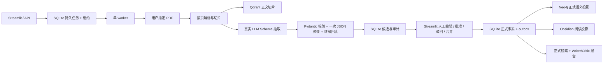

# AI-Research-Agent → Research Knowledge Core 全流程开发复盘与简历素材

> 文档快照：2026-08-05  
> 历史基线：纯 v1 提交 `1fb7dc6`；归档 tag `v1-archive-1fb7dc6`  
> 当前主线：Research Knowledge Core（knowledge-only，不兼容 v1）  
> 事实来源：Git 提交历史、当前源码、测试、`README.md`、`architecture.md`、`development_roadmap.md` 与 `development_journal.md`

> **当前能力口径（重要）**：v1 已完整归档到 `archive/v1/`，仅用于历史复现、复盘和简历取材，不是当前产品能力。本文保留的 Planner、Search Agent、13 节点 ResearchState、旧 GraphRAG、Memory、Evaluation 和旧报告工作台均属于历史开发过程；当前运行时只包含 PDF 知识入库、人工审核、可靠投影、正式知识查询和证据报告。

## 1. 文档用途与阅读方式

这份文档回答四类问题：

1. 项目为什么做、解决了什么问题；
2. 从最初骨架到当前系统，每个阶段具体实现了什么；
3. 关键技术决策、踩坑、修复和仍然存在的边界是什么；
4. 项目完成后，如何把真实、可验证的工作转化为简历和面试材料。

项目中的文档职责如下：

| 文档 | 主要职责 |
| --- | --- |
| `README.md` | 面向使用者的功能介绍、安装和运行说明 |
| `docs/architecture.md` | 当前稳定架构与数据权威边界 |
| `docs/development_roadmap.md` | 阶段目标和后续规划 |
| `docs/development_journal.md` | 真实使用、故障排查和现场数据的持续日志 |
| 本文档 | 从立项到当前的完整开发史、复盘结论和简历素材 |

### 状态口径

- **已提交**：已经进入 `main` Git 历史，可通过提交复现。
- **当前工作区**：已经存在于本地代码和测试中，但截至本快照尚未提交。
- **规划中**：文档或接口中已经留出方向，但不能当作已交付能力写入简历。
- **现场验证**：来自实际任务或本次本地验证，不等同于大规模生产指标。

## 2. 项目一句话总结

Research Knowledge Core 是一个以 SQLite 为业务事实源的本地科研知识系统：它把 PDF 转换为带页码原文的候选知识，经一次性人工审核后可靠投影到 Neo4j 和 Obsidian，并只使用已审核 Qdrant 切片与正式图谱生成可追溯报告。

项目演进包含两代能力，但当前只有一条主线：

| 链路 | 输入 | 主要输出 | 当前状态 |
| --- | --- | --- | --- |
| 多智能体研究报告（v1） | 研究主题、在线检索选项、可选 PDF | 中文 Markdown 报告、质量审计、可选记忆与 Obsidian 导出 | **已归档、非当前能力** |
| Research Knowledge Core | 本地或远程 PDF、主题、研究问题 | 候选审核、正式语义图、正文向量、Obsidian 阅读库、正式证据报告 | **当前主线** |

## 3. 问题背景与产品目标

### 3.1 原始问题

普通聊天式科研助手往往存在以下断点：

- 只有一次性回答，没有显式计划和可追踪执行过程；
- 搜索结果元数据、论文全文和离线样例容易被混为同等可信的证据；
- 单纯向量检索难以表达论文、方法、任务、数据集和指标之间的多跳关系；
- 报告生成后缺乏质量检查、受控修订和最终复评；
- 研究结果保存在对话里，难以形成长期可读、可审核的个人知识库；
- LLM 抽取结果可能格式错误、缺少原文证据或产生重复实体，不能直接作为正式知识。

### 3.2 三层目标

1. **知识结构化**：将用户指定 PDF 转换成有页码、切片和原文摘录的候选知识。
2. **结果可信化**：候选经过 Schema、证据校验和人工审核后，才成为 SQLite 正式事实并投影到下游。
3. **知识再利用**：只消费已审核正文与正式图路径生成报告，使主要结论可回溯到 PDF 页码和原文。

### 3.3 明确的非目标

- 离线 mock 数据只用于演示和测试，不能冒充正式科研知识。
- 在线搜索只返回候选论文，不会自动下载所有搜索结果的 PDF。
- Obsidian 是面向人的可读投影，不是机器事实源。
- Knowledge Core 不允许 LLM 直接绕过审核写入正式图谱。
- 当前不声称已经完成大规模生产部署、并发压测或公开行业基准评测。

## 4. 技术栈与模块边界

### 4.1 技术栈

| 层次 | 技术 | 作用 |
| --- | --- | --- |
| 语言与类型 | Python 3.11+、Pydantic v2 | 领域模型、配置和 LLM 输出校验 |
| LLM 接入 | LangChain OpenAI-compatible API | 统一接入 OpenAI、Qwen、DeepSeek |
| 文档与检索 | pypdf、hash/OpenAI embedding | PDF 按页解析、全文切片和语义检索 |
| 向量存储 | Qdrant 1.18 | 已审核论文白名单内的正文检索 |
| 图存储 | Neo4j 5 | 正式实体关系和多跳路径投影 |
| 业务事实 | SQLite | 任务、候选、审核、正式事实、outbox、报告和迁移 |
| 人类阅读 | Obsidian Markdown、Canvas | 可重建知识笔记和图谱投影 |
| 服务与交互 | FastAPI、Streamlit、Typer/Rich | API、Web 工作台和 CLI |
| 工程化 | Docker、Docker Compose、pytest、Ruff | 部署、测试和静态检查 |

### 4.2 当前代码模块

| 模块 | 职责 |
| --- | --- |
| `app/api` | Knowledge/Reports API 与健康状态 |
| `app/config` | 主线配置、Provider、存储与任务参数 |
| `app/knowledge` | Schema 抽取、SQLite 仓储、任务、审核、查询、投影、报告与 benchmark |
| `app/llms` | OpenAI-compatible 与确定性 mock Provider |
| `app/retrieval` | 主线 embedding 能力 |
| `app/schemas` | PDF 文档领域模型 |
| `app/tools` | PDF 解析工具 |
| `app/ui` | Streamlit 入库、审核、探索、任务历史和报告页面 |
| `app/worker.py` | SQLite 任务租约、入库执行、报告执行与 outbox 投影 |

旧 `app/agents`、`app/graph`、`app/graphrag`、`app/memory`、`app/evaluation` 等模块只存在于 `archive/v1/`，不属于当前代码模块。

## 5. 当前端到端架构

### 5.1 v1 研究报告工作流（已归档）

```mermaid
flowchart LR
    Q["研究主题"] --> M["长期记忆召回"]
    M --> P["Planner"]
    P --> T["工具执行"]
    T --> S["论文检索"]
    S --> D["PDF / 文档处理"]
    D --> K["实体与关系抽取"]
    K --> V["向量检索"]
    V --> G["GraphRAG 推理"]
    G --> W["Writer 报告"]
    W --> C["Critic + 质量评估"]
    C --> R["一次受控 Reflection 修订"]
    R --> O["合格后可选 Obsidian 导出"]
    O --> MW["合格后可选长期记忆写入"]
```



该链路由 13 个 LangGraph 节点组成，现仅用于解释历史演进；实现已冻结在 `archive/v1/`，当前运行时不会导入。

### 5.2 Research Knowledge Core（当前工作区）



### 5.3 数据权威边界

| 数据 | 权威来源 | 说明 |
| --- | --- | --- |
| 入库/报告任务、候选、审核、正式事实、outbox、报告 | SQLite | 唯一业务事实源；页面刷新和服务重启后仍可恢复 |
| 已审核语义节点、关系和图证据投影 | Neo4j | 可从 SQLite 重建；物理标签暂保留 `V2` 后缀 |
| PDF 正文切片及向量 | Qdrant | 使用独立 `knowledge_chunks_v2` collection |
| 人工阅读笔记、MOC、Canvas | Obsidian | 可再生的人类阅读投影，保留“人工笔记”区 |
| v1 运行级研究报告 | `archive/v1/` 与 Git tag | 冻结历史，不参与主线读取、测试或发布 |

## 6. 从零到当前的阶段时间线

### 6.1 Git 里程碑总表

| 日期 | 提交 | 阶段 | 核心交付 | 变更规模 | 提交后测试数 |
| --- | --- | --- | --- | ---: | ---: |
| 2026-07-31 16:15 | `a38aec9` | Phase 0-1 | 项目骨架、配置、LLM 抽象、Planner、工具注册、LangGraph、CLI | 28 文件，+998 | 1 |
| 2026-07-31 16:35 | `a6b6764` | Phase 2 | 论文检索、PDF、切片、embedding、内存/Qdrant、RAG Agent | 26 文件，+1254/-44 | 3 |
| 2026-07-31 16:47 | `30f752b` | Phase 3 | 实体关系抽取、内存/Neo4j、图路径和 GraphRAG 推理 | 22 文件，+1123/-28 | 6 |
| 2026-07-31 17:01 | `34e440f` | Phase 4 | 长期记忆、Critic、Reflection、Evaluation 闭环 | 23 文件，+710/-26 | 8 |
| 2026-07-31 17:21 | `a29c5c1` | 中文化 | 中文默认输出、DeepSeek 模型白名单和设置测试 | 22 文件，+326/-227 | 10 |
| 2026-08-03 09:36 | `82b6f11` | 稳定性 | Planner 工具去重/限界、论文去重、中文图实体抽取 | 5 文件，+160/-9 | 13 |
| 2026-08-03 15:37 | `b5ea43a` | 研究质量 | 显式 PDF 全文、多查询检索、相关性评分和关键门槛 | 19 文件，+641/-50 | 19 |
| 2026-08-03 16:38 | `a51c23e` | 写作质量 | Writer Agent、证据约束报告、一次修订、修订后复评 | 19 文件，+528/-34 | 23 |
| 2026-08-03 16:51 | `41e0cbf` | 记忆修复 | 中文字符 2/3-gram 长期记忆召回 | 2 文件，+44/-1 | 24 |
| 2026-08-03 18:32 | `d7e0f04` | Phase 4.3/5 | 证据治理、Obsidian v1、FastAPI、Streamlit、Docker | 45 文件，+1662/-27 | 34 |
| 2026-08-04 10:40 | `1fb7dc6` | 持久化修复 | Qdrant 1.18 API、Neo4j 查询参数、Compose 健康检查 | 12 文件，+184/-49 | 38 |
| 2026-08-05 基线提交 | Knowledge Core 基线 | Knowledge Core 三迭代 | v1 归档、knowledge-only、持久任务/outbox、正式证据报告、真实存储/LLM/Docker/E2E 验收 | 活动树 26 个 Python 文件 | 根 29 个场景 |

“提交后测试数”按测试函数计数，用于展示工程演进，不代表覆盖率。

### 6.2 Phase 0：规划与架构拆分

**目标**

- 不把系统做成一个大 Prompt，而是拆分规划、工具、检索、图谱、写作和评估职责；
- 从第一版就保留本地演示与外部基础设施两种运行模式；
- 用显式 Schema 约束 Agent 之间的输入输出。

**形成的工程原则**

- 编排层只传递状态，不在一个函数中混合所有业务；
- 外部依赖通过 Provider/Protocol 隔离；
- mock 保障开发可运行，但必须与正式证据边界分开；
- 每一阶段同时更新 README、架构、路线图和测试。

**事实边界**

仓库没有独立 PRD 或 Phase 0 单独提交。规划证据来自首个提交内的 `architecture.md`、`development_roadmap.md` 和模块结构，因此应在复盘中写“完成架构规划”，不应写“完成完整用户调研”。

### 6.3 Phase 1：基础 Agent 框架

**实现**

- 建立 Python 3.11+ 项目、环境配置和模块目录；
- 抽象 `LLMClient`，支持 OpenAI、Qwen、DeepSeek 的 OpenAI-compatible 接口以及确定性 mock；
- 使用 Pydantic 定义 `ResearchPlan`、步骤、工具调用、工具结果和执行轨迹；
- 实现 Planner Agent、工具注册表、基础 LangGraph 和 Typer CLI；
- 为 LLM JSON 解析失败或调用异常提供 fallback plan。

**阶段价值**

先稳定“编排契约”，后续 Search、RAG、GraphRAG、Critic 都能以节点形式增加，不需要推翻入口层。

### 6.4 Phase 2：检索与向量 RAG

**实现**

- 增加 arXiv 搜索和离线候选论文；
- 增加本地/远程 PDF 解析；
- 实现文档切片、轻量 hash embedding 和 OpenAI embedding；
- 抽象 `VectorStore`，实现内存和 Qdrant 两套后端；
- 接入 Search、Document、Reasoning Agent 和 RAG 节点。

**早期取舍**

hash embedding 和离线数据降低了启动门槛，适合验证工作流；代价是它们不能证明真实论文上的研究质量，后续必须增加来源等级与正式准入门槛。

### 6.5 Phase 3：GraphRAG

**实现**

- 定义图实体、关系、路径和 GraphRAG 结果 Schema；
- 使用启发式规则从切片中抽取概念、方法、数据集、指标和任务；
- 同时提供内存图存储和 Neo4j 持久化适配；
- 将查询关联到图节点，检索一跳/两跳路径；
- 将向量证据和图路径交给 GraphRAG Reasoner 联合总结。

**边界**

v1 图抽取为了离线确定性采用启发式规则，适合演示和回归测试，不等同于高精度知识抽取；这也是后来单独设计 v2 Schema LLM 抽取链路的原因。

### 6.6 Phase 4：记忆、评估、Critic 与 Reflection

**实现**

- 在规划前召回 JSON 长期记忆；
- 对检索覆盖、图结构、报告结构等维度进行确定性评估；
- Critic 根据指标给出是否需要修订和改进意见；
- Reflection 修改报告，并将最终结果写入长期记忆；
- 记录每个节点的 Agent Trace，支持 CLI 和 UI 展示执行过程。

**设计取舍**

评估和基础 Critic 先采用确定性逻辑，确保本地测试稳定；LLM 负责文字生成时仍保留结构化质量门，避免“模型自评即通过”。

### 6.7 中文化与模型配置安全

**实现**

- 默认计划、报告、Critic、Reflection、执行轨迹切换为中文；
- 保留英文模块名和工具名，兼顾工程调试与 GitHub 展示；
- DeepSeek 只允许 `deepseek-v4-flash` 和 `deepseek-v4-pro`，通过 Pydantic validator 拒绝旧模型名；
- 增加设置层测试，防止环境变量误配静默进入运行时。

### 6.8 Planner 与中文图抽取稳定性

**发现的问题**

- LLM 可能生成重复工具调用、未知工具或错误的查询参数；
- Search 工具结果和 Search Agent fallback 可能产生重复论文；
- 英文正则中的 `\b` 不能正确处理中文短语边界。

**修复**

- Planner 将可执行工具收敛为关键词扩展和论文搜索，覆盖 query 参数、去重工具名，并在无合法调用时回退；
- 搜索节点按论文 ID 去重；
- ASCII 短语继续使用单词边界，中文短语改用包含判断；
- 扩展知识图谱、向量检索、多跳推理、引用等中文实体词表。

### 6.9 全文研究质量与相关性门槛

**发现的问题**

搜索结果的标题和摘要不足以支撑全文级科研结论；通用语义相似度也可能让“提到 GraphRAG 但不回答具体问题”的材料获得较高分。

**修复**

- 搜索候选与用户显式指定的 PDF 全文分开处理；
- PDF 解析结果按真实全文切片，并保留本地路径、URL、页数和来源类型；
- 构建多查询 arXiv 检索与主题感知重排；
- 增加中英文概念扩展、概念覆盖、token overlap 和综合相关性；
- 将相关性加入 Critical Metric，关键项过低时不能被其他结构分数抵消。

**产品含义**

用户掌控哪些 PDF 可以成为主要全文证据，系统不会因为“搜索到了”就自动把所有论文当成已读全文。

### 6.10 Writer、受控修订与最终复评

**实现**

- Writer Agent 基于计划、论文、向量命中和图路径生成证据约束的中文报告；
- Critic 同时读取确定性评估和报告内容；
- Reflection 最多执行一次受控 Writer 修订，避免无界自我循环；
- 修订后重新评估并生成最终质量审计，而不是沿用修订前分数。

**工程价值**

把“生成—评估—修订—复评”变成可测试状态转换，并对成本和循环次数设置明确上限。

### 6.11 中文长期记忆召回修复

**问题**

初版 tokenizer 只匹配英文和数字，中文连续文本无法按空格分词，导致已保存的中文研究记录无法召回。

**修复**

- 英文继续使用词法 token；
- 中文片段生成 2-gram 和 3-gram 特征；
- 不引入额外分词依赖，同时保留对相近中文研究主题的轻量匹配。

### 6.12 证据治理与产品化

**证据治理**

- 定义 `primary_fulltext`、`online_metadata`、`offline_demo` 三类来源；
- 来源质量进入 Critical Metric；
- 正式证据存在时，从正式报告证据集合中移除离线 demo；
- 离线-only 运行标记为 simulation，不允许写入长期记忆或 Obsidian。

**产品化**

- FastAPI 提供异步研究任务提交、状态、报告、图谱和导出接口；
- Streamlit 展示研究表单、执行轨迹、证据、质量和图数据；
- Obsidian v1 输出报告、论文、概念、Claim、Wiki Links、GraphML 和 JSON；
- Dockerfile 与 Compose 编排 API、UI、Qdrant 和 Neo4j。

### 6.13 持久化集成门槛修复

**问题与修复**

- Qdrant 客户端升级后旧 `search` API 不再适配，改为 `query_points` 并固定 1.18 兼容范围；
- Neo4j 查询参数 `$query` 与驱动调用语义容易冲突，改为 `$query_text`；
- Qdrant 镜像从 1.10.1 升到 1.18.0，并使用新 volume，避免旧数据格式直接复用；
- Compose 端口改为可配置，Neo4j 认证和两个服务的健康检查得到修正；
- 增加 Qdrant、Neo4j 和正式导出拒绝条件的契约测试。

### 6.14 Knowledge Base v2：从报告导出到正式知识流

**为什么新建 v2，而不是继续扩展 v1**

v1 图谱强调离线可运行和研究过程展示；正式知识库则要求真实全文、严格 Schema、页码证据、人工审核、持久审计和稳定实体。两者可靠性标准不同，因此 v2 使用独立目录、表、Neo4j 标签、Qdrant collection 和 Obsidian Vault，避免历史数据被新语义污染。

**当前实现**

- 只接收本地或远程 PDF；提交前必须配置真实 OpenAI、Qwen 或 DeepSeek，mock 被明确拒绝；
- 按页切片，证据包含 `paper_id`、`chunk_id`、页码范围和原文摘录；
- LLM 输出经过 Pydantic Schema 校验，失败时只允许一次 JSON repair；
- 不存在于切片中的 quote 会回填为真实切片摘录，非法端点关系会被过滤；
- 实体类型限制为 8 类，关系限制为 9 类；
- SQLite 保存任务、文档、候选、审核事件、规范实体、关系与主题映射；
- 对标准化名称和别名进行精确/相似合并建议，但是否合并必须由用户确认；
- 批量审核先发布无冲突实体，再发布端点已经规范化的关系；
- Neo4j 只使用 `KnowledgeEntityV2`、`KnowledgeTopicV2`、`KG_RELATION_V2`；
- Qdrant 使用 `knowledge_chunks_v2`；
- Obsidian v2 只渲染已发布内容，Canvas 上限为 25 个文件节点、35 条高置信度边；
- 自动重建笔记时保留 `## 人工笔记` 以下的用户内容；
- Streamlit 提供入库、审核、知识探索和任务历史页面；
- 服务启动时把残留的 `queued/running` 任务标为 `interrupted`，允许用户重试。

**现场验证**

2026-08-04 对一个“Agent 智能体研究”任务进行 SQLite 只读核查：

| 状态 | 实体 | 关系 | 合计 |
| --- | ---: | ---: | ---: |
| 已发布 | 129 | 198 | 327 |
| 待审核 | 7 | 13 | 20 |
| 总计 | 136 | 211 | 347 |

7 个待审核实体都有精确合并建议，13 条关系至少有一个端点依赖这些实体。327 个已发布候选对应 327 条审核事件，未发现顺序重复点击造成的重复事件。该结果只证明当前页面的顺序重放行为，不代表接口已经具备并发幂等保证。

## 7. 关键架构决策与取舍

| 决策 | 为什么这样做 | 收益 | 代价/边界 |
| --- | --- | --- | --- |
| LangGraph 显式节点 + TypedDict 状态 | 多阶段研究需要可追踪中间态 | 节点可测试、可插拔、轨迹清晰 | 当前主链路仍是固定顺序，动态路由有限 |
| LLM Provider 抽象 | 国内外模型和本地演示环境不同 | OpenAI/Qwen/DeepSeek 共用接口 | OpenAI-compatible 行为差异仍需集成验证 |
| 默认 mock + 正式 v2 禁止 mock | 开发可运行与正式知识可信是两种需求 | 本地回归稳定，正式链路不生成伪知识 | 使用者必须理解 demo 和 formal 的区别 |
| 内存/持久化双后端 | 降低首次启动门槛 | 无 Docker 可演示，有基础设施可持久化 | 两套后端需要契约测试保持一致 |
| 搜索元数据与 PDF 全文分离 | 搜索到不等于读过全文 | 证据语义更准确 | 需要用户显式选择 PDF |
| Critical Metric | 平均分会掩盖单个致命低分 | 低相关/低来源质量不能被结构分抵消 | 阈值仍需真实数据标定 |
| 一次受控 Reflection | 防止 Agent 无限自我修订 | 成本、时延和行为可预测 | 一次修订可能不足以解决复杂问题 |
| SQLite/Neo4j/Qdrant/Obsidian 分权 | 审计、图、向量、阅读的查询模式不同 | 每个存储承担适合的职责 | 跨存储一致性需要补偿机制 |
| v1/v2 命名空间隔离 | 两条链路质量标准不同 | 避免旧启发式图污染正式知识 | 维护两套投影逻辑 |
| 人工确认实体合并 | 自动模糊合并可能破坏知识语义 | 规范实体可解释、可审计 | 审核成本增加 |
| 有界 MOC/Canvas | 全局知识图容易变成 hairball | 阅读入口清晰、可导航 | 视图是精选投影，不展示所有关系 |
| 自动区 + 人工笔记区 | Obsidian 既要可再生又要允许用户积累 | 重建不会覆盖个人判断 | 依赖稳定 section marker |

## 8. 关键问题、诊断与解决方案

| 问题 | 根因 | 解决方案 | 验证方式 |
| --- | --- | --- | --- |
| Planner 重复或调用未知工具 | LLM 输出不完全受控 | 参数覆盖、白名单、按工具名去重、空结果 fallback | Planner 单测 |
| 候选论文重复 | 工具结果与 fallback 可能重叠 | 按论文 ID/来源标题去重 | Planner/搜索测试 |
| 中文实体无法匹配 | 英文 `\b` 不适用于中文 | ASCII 使用边界，中文使用 substring | 中文 GraphRAG 测试 |
| 搜索摘要被当作全文证据 | 早期文档链路没有内容等级 | 显式 PDF ingestion + `content_kind` + 来源 tier | 文档 ingestion 测试 |
| 通用相似度高但不回答问题 | embedding 分数缺少主题覆盖约束 | 查询扩展、概念覆盖、词重叠和关键相关性门 | Retrieval/quality 测试 |
| Writer 修订后仍显示旧分数 | 只评估初稿 | 修订后重新运行 evaluator 和 critic | Quality 测试 |
| Reflection 可能无限循环 | 没有明确预算 | 最多一次受控 Writer revision | Writer/Reflection 测试 |
| 中文记忆无法召回 | tokenizer 只识别英文数字 | 中文 2/3-gram | 中文 memory 测试 |
| 离线样例污染记忆或知识库 | demo 与正式来源未分权 | provenance tier + admission gate | Evidence/Obsidian/memory 测试 |
| Qdrant 持久化接口失效 | 客户端 API 升级 | `query_points` + 版本固定 | Qdrant 契约测试 |
| Neo4j 查询参数冲突 | `$query` 命名不稳妥 | 改用 `$query_text` | Neo4j 契约测试 |
| LLM 输出非法 JSON | 生成式输出不稳定 | Pydantic 校验 + 一次 repair | v2 extractor 测试 |
| LLM 证据页码/quote 错误 | 模型可能编造引用位置 | 按真实 chunk 回填 ID、页码和原文 | v2 grounding 测试 |
| 同义实体重复 | 不同论文命名和别名不一致 | exact/similar suggestion + 人工 merge | repository merge 测试 |
| 服务重启丢失任务状态 | 任务只存在执行线程 | SQLite 持久化并标记 interrupted | repository reopen 测试 |
| Obsidian 全局图不可读 | 节点和共现边过多 | 语义类型约束、主题 MOC、有界 Canvas | v2 workflow 测试 |
| 批量审核看似成功但仍有 draft | 冲突实体与关系端点依赖被跳过 | 先人工合并冲突实体，再批量发布关系 | 347 候选现场对账 |

## 9. 测试、代码质量与可复现基线

### 9.1 当前 Knowledge Core 工作区规模

| 指标 | 数值 | 统计口径 |
| --- | ---: | --- |
| Git 提交 | 11 | `main` 历史 |
| 活跃提交日期 | 3 | 2026-07-31、08-03、08-04 |
| `app` Python 文件 | 26 | 排除 `archive/` 和 `__pycache__` |
| `app` + `main.py` 代码行 | 4,867 | 含空行和注释 |
| 根测试文件 | 11 | `tests/test_*.py` |
| 根测试函数 | 29 | `def test_*` / `async def test_*` |
| 根测试代码行 | 1,415 | 含空行和注释 |

以上是规模指标，不等同于代码质量或测试覆盖率。

### 9.2 2026-08-05 本地验证结果

```text
.venv/bin/pytest -q
26 passed, 3 skipped, 1 warning

RUN_STORE_INTEGRATION=1 .venv/bin/pytest -q
28 passed, 1 skipped, 1 warning

RUN_LIVE_LLM_INTEGRATION=1 \
  .venv/bin/pytest -q tests/test_report_live_integration.py
1 passed in 4.73s

cd archive/v1 && ../../.venv/bin/pytest -q
38 passed

.venv/bin/ruff check .
All checks passed!

git diff --check
passed

docker build --pull=false -t research-knowledge-core:verification .
passed; /app/archive absent; GET /health = 200
```

唯一 warning 来自 FastAPI/Starlette TestClient 对 `httpx` 兼容层的弃用提示，不影响当前测试通过，但应在依赖升级时处理。

验证时应直接使用项目 `.venv/bin/python`、`.venv/bin/pytest` 和 `.venv/bin/ruff`，避免系统 Python 版本与依赖差异。真实存储和真实 LLM 测试默认跳过，必须显式开启；LLM smoke 只使用合成证据。

### 9.3 测试覆盖的行为

| 测试域 | 已覆盖行为 |
| --- | --- |
| 归档隔离 | v1 tag、目录完整性、根导入/路由/Docker context 隔离 |
| API | Knowledge/Reports 路由、旧 v1 路由 404、健康状态 |
| 抽取与投影 | JSON repair、证据回填、Qdrant 先写、Neo4j/Obsidian 幂等投影 |
| 审核与一致性 | 条件更新、并发重放、唯一 review event、事实与 outbox 同事务 |
| 可靠任务 | SQLite 队列、租约过期领取、attempts/error、失败恢复 |
| 报告 | 正式知识白名单、grounding、覆盖/忠实度、一次修订、持久化元数据 |
| 评测与 E2E | 10 PDF/30 问题 Recall@5、真实存储、浏览器闭环、合成证据真实 LLM smoke |

### 9.4 尚未覆盖或不能由当前结果证明

- 没有记录语句/分支覆盖率，不能写“测试覆盖率达到 X%”；
- 真实 LLM smoke 使用合成证据，不能外推到真实论文或开放域报告质量；
- Provider 单价未配置，已记录 token 和时延，但美元成本仍为 `null`；
- 浏览器 E2E 已真实操作 UI，但尚未固化为 CI 自动作业；
- 没有压力、长时间稳定性、安全、鉴权、多用户或分布式部署测试；
- 30 问题集是项目内固定演示集，不是公开行业基准。

## 10. 运行、验证与交付流程

### 10.1 本地环境

```bash
source .venv/bin/activate
pytest -q
ruff check .
```

如果需要重建环境：

```bash
python3.11 -m venv .venv
source .venv/bin/activate
pip install -r requirements.txt
cp .env.example .env
```

### 10.2 v1 历史工作流复现

根项目不再提供 CLI `run`。如需复现旧多智能体研究工作流，只能进入冻结归档并使用其独立虚拟环境：

```bash
cd archive/v1
python3.11 -m venv .venv
source .venv/bin/activate
pip install -r requirements.lock
python main.py run "GraphRAG 在科研文献综述中的应用" --offline
```

该命令是历史复现入口，不是当前产品使用方式。

### 10.3 Research Knowledge Core

1. 在 `.env` 配置真实 LLM；
2. 启动 Neo4j 与 Qdrant；
3. 启动 API 和 Streamlit；
4. 在“知识入库”提交 PDF；
5. 在“审核队列”完成编辑、批准、驳回或合并；
6. 在“知识探索”和 Obsidian 阅读已发布内容，并在“研究报告”基于正式知识生成报告。

```bash
docker compose up qdrant neo4j
.venv/bin/uvicorn app.api.main:create_app --factory --reload --port 8000
AI_RESEARCH_API_URL=http://localhost:8000 \
  .venv/bin/streamlit run app/ui/streamlit_app.py
```

### 10.4 全容器交付

```bash
docker compose up --build
```

Compose 默认提供 Qdrant `6333`、Neo4j `7474/7687`、API `8000` 和 Streamlit `8501`，均可通过环境变量覆盖宿主机端口。

## 11. 项目成果如何写入简历

### 11.1 项目标题与简介

**项目名称**：Research Knowledge Core｜可审核、可恢复的科研知识与证据报告系统

**一句话简介**：构建以 SQLite 为业务事实源的本地科研知识系统，将 PDF 抽取结果经人工审核发布，并通过持久任务、事务 outbox 和幂等投影同步到 Qdrant、Neo4j 与 Obsidian，最终生成页码可追溯的证据报告。

**技术栈**：Python、LangChain、Pydantic、FastAPI、Streamlit、Qdrant、Neo4j、SQLite、Obsidian、Docker、pytest、Ruff。

### 11.2 通用版项目要点

下面的表述只使用仓库中可验证的事实。根据个人真实分工，将“设计并实现”调整为“负责”或“参与”。

- 将纯 v1 提交冻结为可运行 Git tag 与 `archive/v1/` 快照，清理根运行时、测试、Docker context 和产品文案中的旧 Agent 依赖，使主线收敛为 knowledge-only 架构。
- 构建 PDF-only 可审核入库链路，使用 Schema 校验、一次 JSON 修复、页码/切片/原文证据回填和人工实体合并，将业务事实、语义图、正文向量与阅读笔记分别落入 SQLite、Neo4j、Qdrant 和 Obsidian。
- 以 SQLite 条件更新和唯一约束实现审核幂等，在同一事务写正式事实、审核事件和 projection outbox；单 worker 通过租约、attempts 和失败重放恢复任务与下游投影。
- 重建只消费已审核知识的报告流程，以证据 ID 生成 Markdown，并用确定性 Critic 校验证据落地、引用覆盖、引用忠实度和结构，最多修订一次。
- 完成 FastAPI、Streamlit、CLI、Docker Compose 与版本化评测；根 29 个测试场景、归档 38 项测试、真实 Qdrant/Neo4j 集成、浏览器 E2E 和真实 LLM 合成 smoke 均有保存证据。

### 11.3 AI 应用工程方向版本

- 围绕 LLM 非确定性设计“Schema 校验—一次修复—证据 grounding—人工审核”链路，使模型输出只有经过结构、来源和审核三重约束后才能进入正式知识。
- 针对中英文问题增加确定性技术锚点扩展，在固定 10 PDF / 30 问题集上取得 Recall@5 1.00，并保留论文白名单和原文页码约束。
- 将报告生成实现为 Writer—Critic—一次修订—复评的有界闭环，持久化模型、Prompt、Schema、token、时延和质量指标。

### 11.4 后端/平台工程方向版本

- 使用 FastAPI 与 SQLite 构建持久入库和报告任务状态机，覆盖 queued、running、needs_review、publishing、completed、failed、interrupted，以及租约领取和重试。
- 设计 SQLite 事实源与 Neo4j/Qdrant/Obsidian 可恢复下游的分权架构，以事务 outbox 和稳定 ID `MERGE` 处理跨存储一致性。
- 修复 Qdrant 1.18 查询 API、Neo4j 查询参数、Docker 健康检查和可配置端口等集成问题，并以真实容器测试和镜像启动探针验证。

### 11.5 可量化事实库

可直接使用的数字必须带清晰口径：

- v1 归档包含 13 个 LangGraph 研究节点（历史能力，不是当前运行时）；
- 3 个真实 LLM Provider + 1 个确定性 mock；
- 8 类知识节点、9 类受控语义关系；
- 11 个 Git 提交，当前 `app` + `main.py` 约 4,867 行；
- 根项目 11 个测试文件、29 个测试场景；v1 归档 38 项原测试；
- 单次真实候选审核核查共 347 项，其中 327 项已发布、20 项因实体冲突/端点依赖待处理；
- 固定 10 PDF / 30 问题检索集 Recall@5 1.00、grounding 1.00、平均 63.92 ms；
- 真实 DeepSeek 合成证据 smoke：1 次生成、274/217 输入/输出 token、4,642.56 ms，四项质量指标 1.00。

不应在没有新实验数据时写“检索准确率提升 X%”“报告质量提升 X%”“支持高并发”或“生产可用”。

## 12. 面试复盘素材

### 12.1 STAR 案例一：从搜索元数据到可信全文证据

**Situation**：早期流程能检索论文并生成报告，但搜索标题/摘要与离线示例可能被当成足以支撑全文结论的证据。  
**Task**：在不破坏离线开发体验的前提下，给正式研究建立清晰来源边界。  
**Action**：分离候选搜索与显式 PDF ingestion，增加三层 provenance、全文优先重排、相关性关键指标，并禁止 offline-only 结果写记忆和 Obsidian。  
**Result**：系统可以明确区分 simulation 与 formal research；准入拒绝行为被 evidence、memory 和 exporter 测试覆盖。

### 12.2 STAR 案例二：LLM 结果如何进入正式知识库

**Situation**：LLM 抽取可能返回非法 JSON、错误页码、虚构 quote 或重复实体，直接落图库风险高。  
**Task**：构建可审阅、可追溯、可恢复的 PDF 知识入库流程。  
**Action**：采用受控 Schema、一次 repair、证据回填、SQLite 候选/审核事件、人工 merge、Neo4j/Qdrant v2 隔离和只发布 approved 数据的 Obsidian 投影。  
**Result**：完成 10 PDF 组件测试，并在一个 347 候选任务中对发布状态、冲突依赖和审核事件完成三方对账。

### 12.3 STAR 案例三：持久化后端兼容性修复

**Situation**：内存测试通过不代表 Qdrant、Neo4j 和 Compose 能稳定运行，客户端版本与健康检查存在集成门槛。  
**Task**：让持久化模式具备明确的版本和启动契约。  
**Action**：升级并固定 Qdrant 1.18，改用 `query_points`，修正 Neo4j 参数、认证、健康检查、volume 与端口配置，并加入适配器契约测试。  
**Result**：持久化相关回归进入测试套件，提交 `1fb7dc6` 将测试数从 34 增加到 38。

### 12.4 STAR 案例四：中文场景中的隐性工程问题

**Situation**：英文规则在中文上出现实体匹配和长期记忆召回失效。  
**Task**：在不增加重型 NLP 依赖的前提下改善中文默认体验。  
**Action**：对非 ASCII 实体使用 substring 匹配，扩充中文科研术语；对中文记忆生成字符 2/3-gram；保持英文 token 逻辑不变。  
**Result**：中文 GraphRAG 和中文记忆行为获得独立回归测试，修复过程形成两个可定位提交。

### 12.5 高频追问与回答要点

| 面试问题 | 回答重点 |
| --- | --- |
| v1 为什么用 LangGraph？ | 显式状态、节点级测试和轨迹；这是归档历史方案，当前 Knowledge Core 没有继承旧状态机 |
| 为什么同时使用向量和图？ | 向量找局部语义证据，图表达实体关系与多跳路径；GraphRAG 联合两类上下文 |
| 为什么 Knowledge Core 需要 SQLite？ | Neo4j 适合正式语义图，不适合承担任务状态、草稿、审核事件和失败恢复的全部审计职责 |
| 为什么 mock 在归档可用、主线禁止？ | v1 需要离线开发演示；主线输出会成为长期正式知识，可靠性门槛更高 |
| 如何减少幻觉？ | 全文来源等级、证据 span、Schema、quote grounding、受控关系、人工审核和关键质量门 |
| 如何控制报告生成成本？ | Writer 最多生成一次；质量不通过时最多修订一次并复评，同时记录 token 和时延 |
| 如何处理实体重复？ | 标准化名称/别名生成建议，exact conflict 阻止直接批准，由人选择 canonical entity |
| 当前最大技术债是什么？ | 浏览器 E2E 尚未进入 CI、Provider 美元单价未配置、缺少真实论文报告人工标注和长时间稳定性测试 |

## 13. 当前边界、风险与下一步优先级

### P0：形成可提交、可计价的交付基线

1. **提交边界**：将当前 Knowledge Core 代码、归档、测试、迁移和文档形成独立提交，避免“本地已完成、Git 不可复现”。
2. **成本口径**：配置所用 Provider 的输入/输出单价，让已经持久化的 token 统计可以计算 `cost_usd`。
3. **CI E2E**：把已经人工执行通过的浏览器 fixture 固化为可重复的 CI 作业。

### P1：加强运维和真实语料评测

1. 为报告任务增加显式重试 API、失败原因筛选和管理视图；
2. 增加 outbox 管理视图、按 ingestion 重建投影和失败告警；
3. 在固定真实 PDF 上增加报告人工标注，记录主要结论覆盖、通过率、成本与端到端时延；
4. 增加结构化日志、任务耗时、失败率、队列长度和投影重试指标；
5. 增加长时间稳定性、压力和故障注入测试。

### P2：边界变化后再评估

1. 只有单用户边界改变后才增加登录、租户隔离或分布式队列；
2. 评估是否以全新状态和节点引入 LangGraph 报告编排，不从 v1 归档复用实现；
3. 增加图排序、实体消歧、跨主题知识复用和差异审查；
4. 增加报告 PDF 导出、示例报告、演示截图和公开 benchmark。

## 14. 项目完成后的复盘框架

项目收尾时建议用以下问题复盘，而不是只复述功能列表：

### 产品

- 最核心用户是谁：科研人员、学生、知识管理用户还是 AI 工程演示者？
- 用户真正重复使用的是研究报告链路还是 PDF 知识库链路？
- 人工审核的平均耗时、冲突率和通过率是多少？
- 哪些自动生成内容真正被用户保留或二次编辑？

### 技术

- 哪些 Agent 节点必须使用 LLM，哪些确定性逻辑效果更稳定？
- GraphRAG 相比纯向量 RAG 在标注问题上带来了什么可测收益？
- Critical Metric 的阈值是否经过数据标定？
- SQLite、Neo4j、Qdrant 之间出现过哪些不一致，如何恢复？

### 工程

- 最常见的失败点是网络、PDF、LLM Schema、数据库还是人工审核？
- 平均每篇 PDF 的页数、切片数、token、耗时和成本是多少？
- 当前根项目 29 个测试场景中，哪些最能阻止真实回归，哪些只是结构测试？
- 是否可以用一次命令在新机器上完成环境重建和端到端验证？

### 简历

- 个人负责的模块和团队协作边界是什么？
- 哪些结果有 Git、测试、日志或用户数据支撑？
- 哪些数字是规模，哪些数字是效果，二者是否被清楚区分？
- 面试时能否讲清一个设计取舍、一个线上/现场问题和一个失败经验？

## 15. 后续文档维护规则

每次完成重要功能、排障或真实试用后：

1. 在 `development_journal.md` 增加日期、场景、调用链、数据、结论和风险；
2. 架构权威边界发生变化时更新 `architecture.md`；
3. 里程碑完成或优先级变化时更新 `development_roadmap.md`；
4. 形成提交后，在本文档的时间线、测试基线和简历事实库中补充记录；
5. 所有量化结果记录命令、样本和日期，效果指标必须保留基线对照。

建议每次里程碑至少保存以下证据：

```text
日期：
用户场景：
问题与影响：
关键调用链：
设计决策与替代方案：
实现模块：
验证命令与结果：
真实样本/指标：
已知边界：
对应 Git 提交：
可复用简历表述：
```

---

## 附录 A：当前 API 能力摘要

旧 `/api/research`、`/api/tasks/*` 和旧导出接口已随 v1 归档，当前根项目对它们返回 `404`。

### Knowledge Core API

- `POST /api/knowledge/ingestions`：提交 PDF 入库；
- `GET /api/knowledge/ingestions` / `/{id}`：任务历史与状态；
- `POST /api/knowledge/ingestions/{id}/retry`：重试失败/中断任务；
- `GET /api/knowledge/ingestions/{id}/candidates`：查询候选；
- `PATCH /api/knowledge/candidates/{id}`：编辑候选；
- `POST /api/knowledge/candidates/{id}/decision`：批准、驳回或合并；
- `POST /api/knowledge/ingestions/{id}/approve-ready`：批量批准无冲突候选；
- `GET /api/knowledge/topics` / `/{slug}`：主题列表与详情；
- `GET /api/knowledge/graph`：正式知识图谱数据；
- `GET /api/knowledge/search`：只检索已发布论文允许范围内的正式切片。

### Grounded Reports API

- `POST /api/reports`：创建持久报告任务；
- `GET /api/reports` / `/{id}`：列表与详情；
- `GET /api/reports/{id}/evidence`：证据包和质量评估；
- `GET /api/reports/{id}/download`：下载 Markdown。

## 附录 B：阶段演进的核心认识

1. **先做可运行，再做可信**：mock、内存库和启发式抽取让系统快速形成闭环，但随后必须用 provenance、全文证据和审核机制划清正式边界。
2. **Agent 不等于所有逻辑都交给 LLM**：工具白名单、状态机、Pydantic、质量指标、幂等和持久化都应使用确定性工程手段。
3. **搜索到不等于读过**：元数据适合发现候选，全文才适合支撑具体结论。
4. **平均分不能表达底线**：来源质量或主题相关性过低时，报告结构再完整也不应进入正式知识。
5. **图谱越大不等于越好用**：人类阅读需要受控语义、主题入口、有界视图和可编辑笔记。
6. **可审计比自动化程度更重要**：正式知识链路宁可保留人工审核，也不让不可追溯的抽取直接落入长期系统。
7. **单元测试通过不等于集成完成**：Qdrant、Neo4j、Docker、LLM 和 UI 都需要各自的契约或端到端验证。

## 附录 C：2026-08-05 Knowledge Core 收敛结果

### 实施结果

- v1 以提交 `1fb7dc6` 建立完整可运行快照和 Git tag；归档 38 项原测试独立通过。
- 根活动树移除 v1 专属 Agent、GraphRAG、Memory、Evaluation、API、UI、CLI、配置和测试，归档不进入 Ruff、根 pytest 或 Docker context。
- SQLite 增加顺序迁移、持久任务、租约、尝试次数、最近错误、projection outbox 和报告表。
- 审核事实、唯一 review event 与 outbox 在同一事务提交；顺序和双线程重放均验证只生成一份正式记录。
- 347 候选测试准确返回 327 项发布、7 个冲突实体和 13 条阻塞关系。
- 独立 worker 可恢复任务和投影；Neo4j 故障不丢 SQLite 正式事实，Obsidian 重建保留人工笔记。
- 新报告接口只消费已发布知识，最多一次修订，持久化正文、证据包、grounding、引用覆盖、引用忠实度和结构评分。
- 建立十 PDF、30 标注问题的 Recall@5 评测集和可重复 runner。
- 使用隔离临时库和本地 fixture 完成真实浏览器“入库—审核—投影—报告—证据包”E2E，不触碰现有知识库或外部模型。
- 使用代码内完全合成证据完成 DeepSeek 真实模型 smoke，不读取或外传现有知识库。
- 根 Docker 镜像完成实际构建、归档隔离、路由边界和 HTTP 健康验收。

### 当前可验证基线

```text
archive/v1: 38 passed
root knowledge-only: 26 passed + 3 opt-in skipped
real Qdrant/Neo4j: 28 passed + 1 live-LLM skipped
real LLM synthetic smoke: 1 passed
并发审核：1 fact + 1 review_event + 1 outbox
347 候选：327 published + 7 conflicts + 13 blocked
Docker: build passed + archive absent + /health 200
```

真实 Qdrant/Neo4j 集成、固定十 PDF Recall@5、隔离浏览器 E2E、合成证据真实 LLM smoke 和 Docker 构建均已保存验证结果。真实模型 smoke 的 4,642.56 ms 与 token 数可以引用，但它不代表真实论文质量；Provider 单价未配置，因此不能宣称美元成本。
